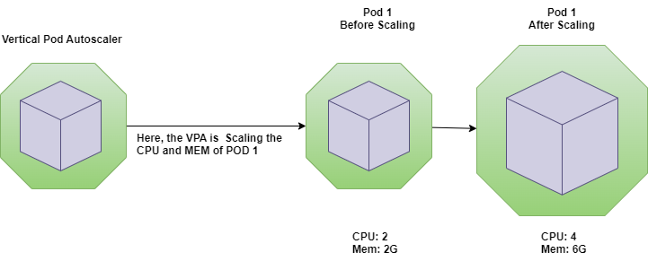

# Kubernetes-Autoscaling

Kubernetes offers multiple levels of capacity management control for autoscaling. this mechanisms can be are:

- [Horizontal Pod Autoscaling (HPA)]()
- [Vertical Pod Autoscaling (VPA)]()
- [The Kubernetes Cluster Autoscaler]()

## Horizontal Pod Autoscaling (HPA)
Horizontal scaling means that the response to increased load is to deploy more Pods. This is different from vertical scaling, which for Kubernetes would mean assigning more resources (for example: memory or CPU) to the Pods that are already running for the workload.

If the load decreases, and the number of Pods is above the configured minimum, the HorizontalPodAutoscaler instructs the workload resource (the Deployment, StatefulSet, or other similar resource) to scale back down.

## Vertical Pod Autoscaling (VPA)

Vertical Pod Autoscaler (VPA) frees users from the necessity of setting up-to-date resource limits and requests for the containers in their pods. When configured, it will set the requests automatically based on usage and thus allow proper scheduling onto nodes so that appropriate resource amount is available for each pod. It will also maintain ratios between limits and requests that were specified in initial containers configuration.

It can both down-scale pods that are over-requesting resources, and also up-scale pods that are under-requesting resources based on their usage over time.

Autoscaling is configured with a Custom Resource Definition object called VerticalPodAutoscaler. It allows to specify which pods should be vertically autoscaled as well as if/how the resource recommendations are applied.

## The Kubernetes Cluster Autoscaler

The Cluster Autoscaler automatically adds or removes nodes in a cluster based on resource requests from pods. The Cluster Autoscaler doesn’t directly measure CPU and memory usage values to make a scaling decision. Instead, it checks every 10 seconds to detect any pods in a pending state, suggesting that the scheduler could not assign them to a node due to insufficient cluster capacity.

this option is not in this demo as I will need admin access to VIO cloud to demo this option.

export KUBECONFIG=/root/demo_kube_config

## for more info

- https://kubernetes.io/docs/tasks/run-application/horizontal-pod-autoscale-walkthrough/
- https://www.densify.com/kubernetes-autoscaling/kubernetes-vpa/
- https://github.com/kubernetes/autoscaler/tree/master/vertical-pod-autoscaler/
- https://github.com/vmware-archive/tgik/tree/master/episodes/126